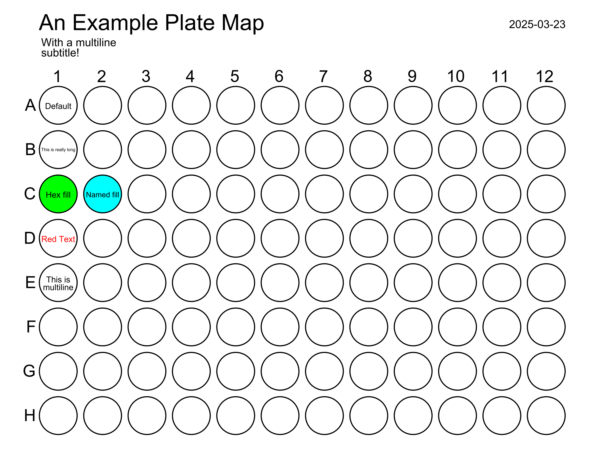

# 96-Well Plate Map Generator
Python script for generating annotated 96-well plate maps containing text with options to specific text color and well fill from a CSV file.

## Quick Start
Download this repository and install the required packages:
```
git clone https://github.com/robertpazdzior/plate_map_generator.git
cd plate_map_generator
pip install -r requirements.txt
```

Generate the example plate map using the following command:
```
python .\plate_map_generator.py -t 'An Example Plate Map' -s "With a multiline\nsubtitle!" .\annotations_example.csv
```
This will generate a similar image to below, with today's date in the filename and top corner.
